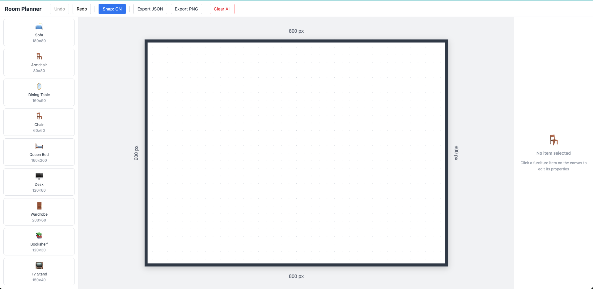
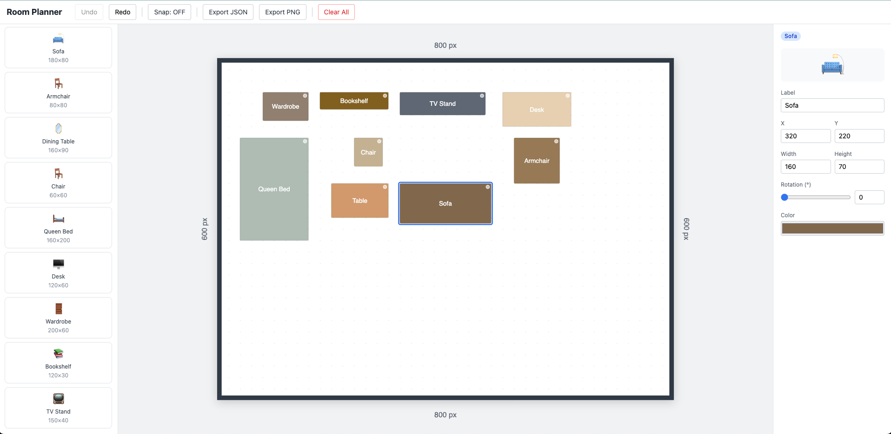

# Room Planner

A browser-based 2D room layout tool that lets you drag, drop, and arrange furniture on a floor plan — no installation, no account, just open and design.

Built as a personal project to explore Vue 3's Composition API at scale, with a focus on clean state management and smooth interactive UX.

---

## Live Demo

**[https://room-planner-simple.vercel.app/](https://room-planner-simple.vercel.app/)**

---

## Demo / Screenshot

<!-- Replace with an actual screenshot once available -->


---

## Tech Stack

| Technology | Why it was chosen |
|---|---|
| **Vue 3** + Composition API | Fine-grained reactivity and `<script setup>` make component logic readable and composable without class-based boilerplate |
| **TypeScript** | Catches shape mismatches between store state and component props at compile time, especially valuable for `FurnitureItem` mutations |
| **Pinia** | Simpler than Vuex, native TypeScript support, and setup-syntax stores feel like plain composables |
| **Vite** | Near-instant HMR during development and lean production bundles |
| **Tailwind CSS v3** | Utility-first styling eliminates context-switching between CSS files and templates for a UI this dense |
| **VueUse** | Battle-tested composables (event listeners, mouse tracking) so the drag logic stays focused on domain math |
| **pinia-plugin-persistedstate** | Layout persists across page reloads with a single `persist` option — no manual localStorage wiring |
| **Vitest** + `@pinia/testing` | Unit tests for store logic run in milliseconds in the same Vite pipeline |

---

## Features

- **Drag & drop placement** — pick any furniture template from the sidebar and drop it anywhere on the canvas
- **9 furniture types** — Sofa, Armchair, Dining Table, Chair, Queen Bed, Desk, Wardrobe, Bookshelf, TV Stand (each with realistic default dimensions)
- **Grid snap** — toggle snap-to-grid on/off from the toolbar for precise or freeform positioning
- **Properties panel** — edit label, X/Y position, width, height, rotation (0–360°), and color of the selected item in real time
- **Rotation live preview** — the icon in the properties panel rotates as you drag the slider
- **Duplicate & delete** — clone any item with a 20px offset or remove it cleanly
- **Undo / Redo** — full history with a 50-entry cap, implemented as a cursor-based stack using `structuredClone`
- **Lock items** — mark an item as locked to prevent accidental moves
- **Export to PNG** — renders the SVG canvas to a high-DPI (2×) PNG via the Canvas API
- **Export / Import JSON** — save the full layout (room config + all furniture) to a versioned JSON file and reload it later; the importer validates every field before applying
- **Persistent state** — furniture layout survives a browser refresh via `localStorage`

---

## Getting Started

### Prerequisites

- Node.js ≥ 18
- npm ≥ 9

### Install & run

```bash
# 1. Clone the repo
git clone https://github.com/PhanVanHieu-Ptit/Room_Planner.git
cd Room_Planner

# 2. Install dependencies
npm install

# 3. Start the dev server
npm run dev
```

Open [http://localhost:5173](http://localhost:5173) in your browser.

### Other commands

```bash
npm run build        # Production build (type-checks first)
npm run preview      # Preview the production build locally
npm run type-check   # Type-check without emitting
npm run test         # Run unit tests with Vitest
npm run lint         # Lint .vue and .ts files
npm run format       # Auto-format with Prettier
```

---

## What I Learned Building This

**State shape design matters early.** Starting with a single `FurnitureItem` interface that captures everything — position, size, rotation, color, lock state — made undo/redo trivial to add later: just snapshot and restore the array.

**Undo/redo is simpler than it looks.** A two-stack (past / future) model with `structuredClone` for deep copies handles 95% of real-world cases cleanly. The tricky part is knowing *when* to snapshot (on drop, on resize-end, on delete) vs. when not to (every pixel while dragging).

**Composables are the right abstraction unit in Vue 3.** Splitting `useDragDrop`, `useSnap`, and `useExport` into separate files kept each concern testable in isolation and made the canvas component readable even as features grew.

**TypeScript pays off at boundaries.** Runtime validation in `importJSON` (checking every field before touching the store) prevented a whole class of "why is furniture missing a property" bugs that would have been silent without types.

**SVG over Canvas for 2D layout tools.** Using an SVG canvas meant rotation, hit-testing, and coordinate math were handled by the browser's own rendering engine — no manual trigonometry needed for item selection.
